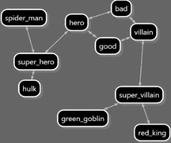

# graph.network

graph.network is a c# graph convultional neural network library that lets you model any domain as a graph and then train that model to predict answers:

```csharp
//1 - create the graph
var gn = new GraphNet("gn", maxPathLenght:10, maxNumberOfPaths: 5);
gn.Add("spider_man", "is_a", "super_hero");
gn.Add("hulk", "is_a", "super_hero");
gn.Add("green_goblin", "is_a", "super_villain");
gn.Add("red_king", "is_a", "super_villain");
gn.Add("super_villain", "is_a", "villain");
gn.Add("super_hero", "is_a", "hero");
gn.Add("hero", "is", "good", true);
gn.Add("hero", "is_not", "bad", true);
gn.Add("villain", "is", "bad", true);
gn.Add("villain", "is_not", "good", true);

//2 - train it with some expected answers
gn.Train(gn.NewExample("spider_man", "good"), gn.NewExample("green_goblin", "bad"));

//3 - predict answers to questions it has not been directly trained on
Assert.AreEqual("good", gn.Predict("hulk"));
Assert.AreEqual("bad", gn.Predict("red_king"));
```

